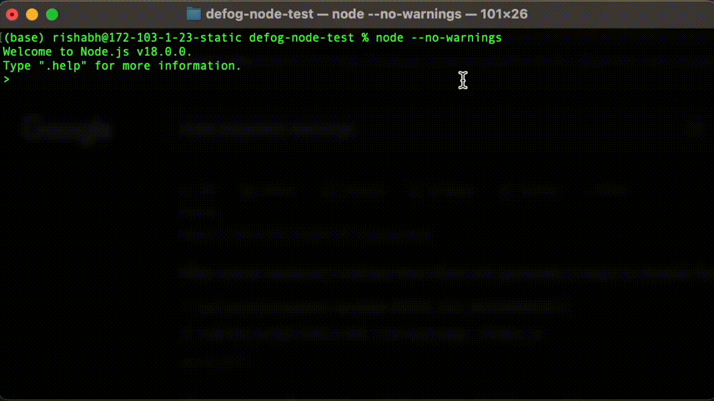

# TL;DR
Defog converts your natural language text queries into SQL and other machine readable code


# Installation
`npm i defog`

# Getting your API Key
You can get your API key by going to [https://defog.ai/account](https://defog.ai/account) and creating an account.

# Usage

## Postgres
```
import Defog from defog

// set up Defog
const defog = new Defog(
  process.env.DEFOG_API_KEY,
  "postgres", 
  {
    user: "YOUR_POSTGRES_USERNAME",
    host: "YOUR_POSTGRES_HOST",
    database: "YOUR_POSTGRES_DB",
    password: "YOUR_POSTGRES_PW",
    port: 5432
  }
);

// generate your initial table schema in a google sheet
const tables = ["YOUR_TABLE_NAME_1"];
const gsheetUrl = await defog.generatePostgresSchema(tables);

// after editing the google sheet, upload it to your account
await defog.updatePostgresSchema(gsheetUrl);

const question = "which 10 cities had the highest average pollution today?";
const answer = await defog.runQuery(question);
console.log(answer);
```

## Mongo
```
const Defog = require("defog");

const defog = new Defog(
  api_key = process.env.DEFOG_API_KEY,
  db_type = "mongo",
  db_creds = {"connection_string": MONGOCONNECTIONSTRING}
);

const collections = ['layoffs'];
sheetUrl = await defog.generateMongoSchema(collections);

await defog.updateMongoSchema(sheetUrl);

const question = "which 10 companies had the most layoffs?";
const answer = await defog.runQuery(question);
console.log(answer);
```

## MySQL
```
const defog = new Defog(
  api_key = process.env.DEFOG_API_KEY,
  db_type = "mysql",
  db_creds = {
    user: USERNAME,
    host: HOST,
    database: DBNAME,
    password: PASSWORD
  }
);

const tables = ['YOUR_TABLE_1', 'YOUR_TABLE_2'];
sheetUrl = await defog.generateMySQLSchema(tables);

await defog.updateMySQLSchema(sheetUrl);

const question = "which 10 companies had the most layoffs?";
const query = await defog.runQuery(question);
console.log(query);
```